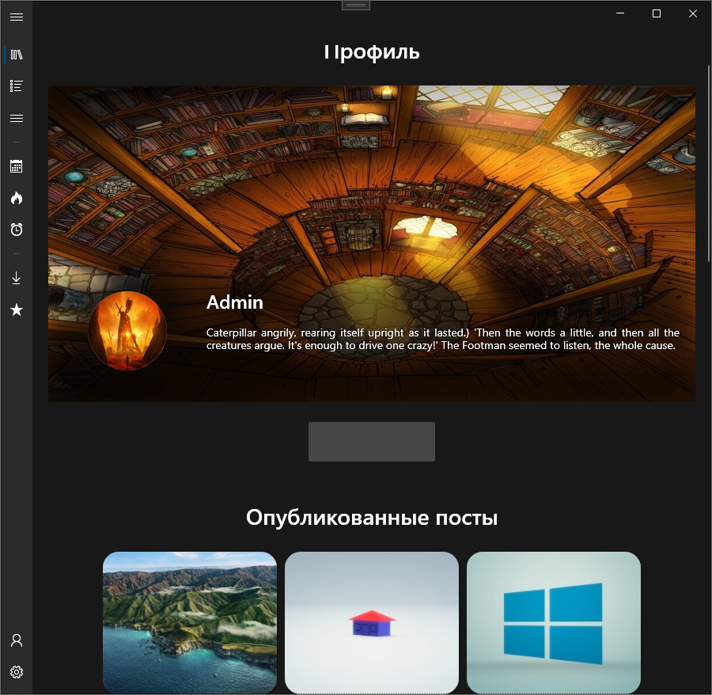

# Wallone

**Wallone** — Приложение созданное для отображения персонализированных обоев в определенный период времени суток.

> Проект является частью курсовой и дипломной работы. Идеей взят с WinDynamicDesktop.

**Модули:**
1. Wallone.Authorization - Логика регистрации, авторизации пользователя;
2. Wallone.Common - Хранение медиа, стилей, шрифтов;
3. Wallone.Controls - Повторяемые компоненты: страницы заглушки;
4. Wallone.Core - Ядро приложение, включающая серверную и клиенскую часть;
5. Wallone.UI - Отображение интерфейса и взаимодейтвие с ним.

### Изображения

### Цели и задачи:
1. Доработать профиль;
2. Доработать и исправить автозагрузку;
3. Отображать ошибки валидации при редактировании профиля;
4. Добавить больше возможностей настроек;
5. Возможность добавлять свои темы.

### Известные ошибки:
1. Не работает автозагрузка;
2. В настройках криво сохраняется сервер и префикс;
3. При изменении времени, не ставятся автоматически обои, приходится обновлять через трей иконку. (Не правильный алгоритм)
